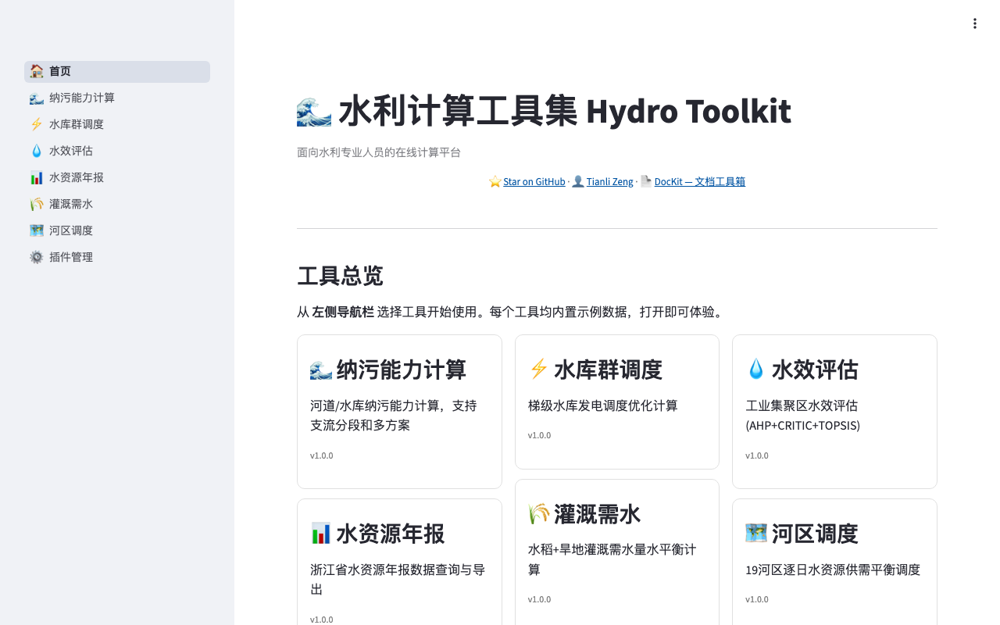
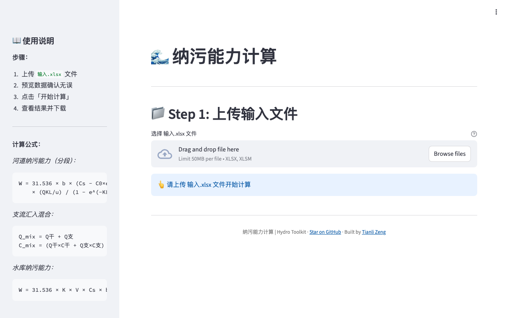
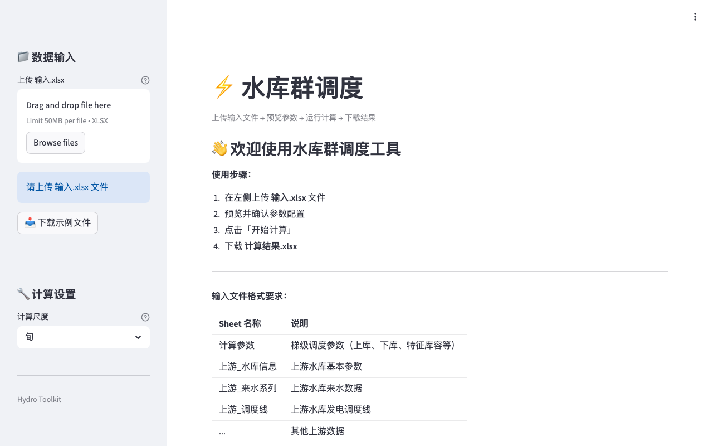
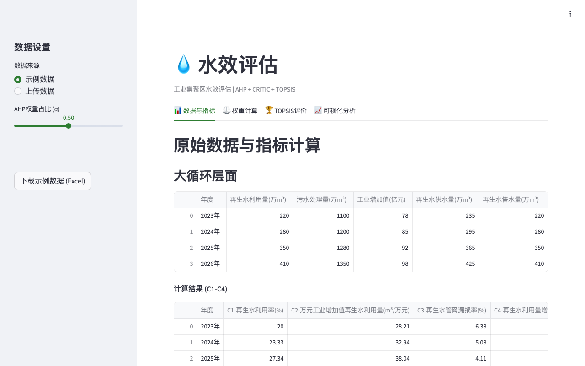
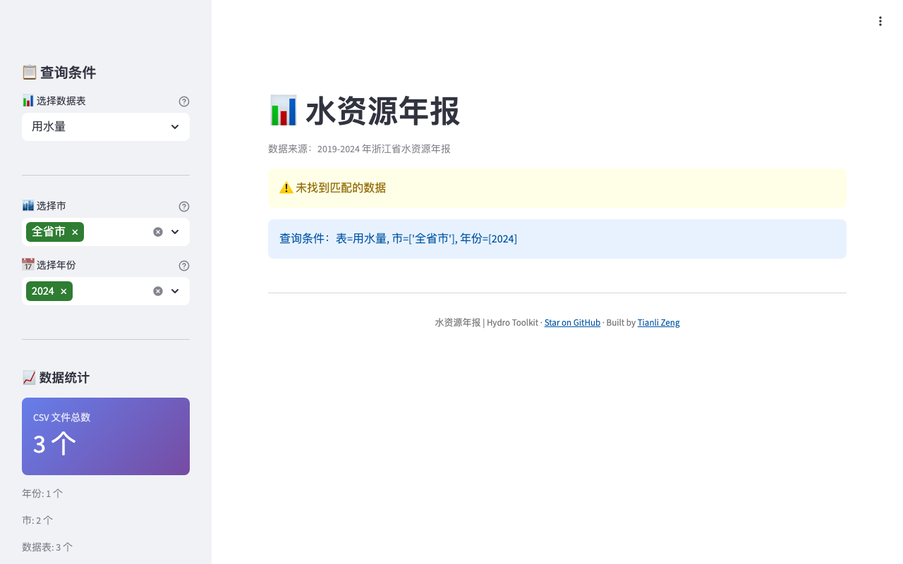
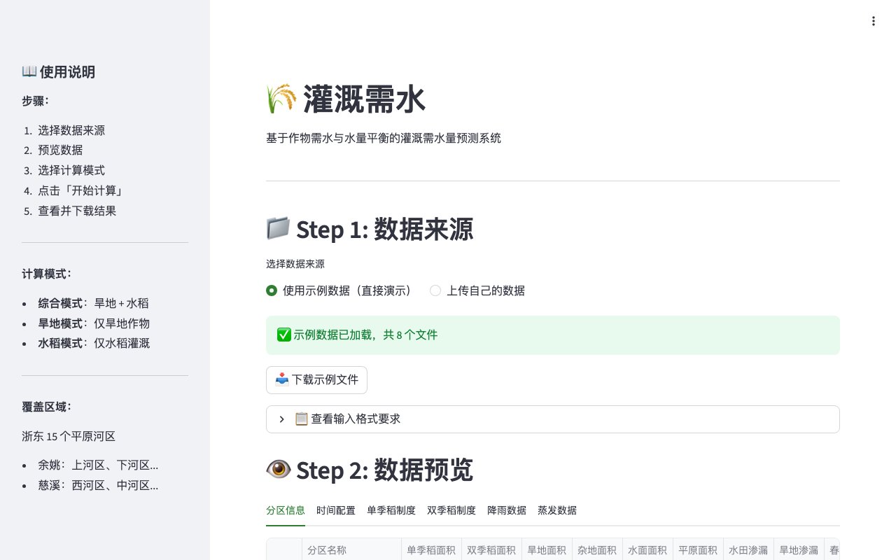
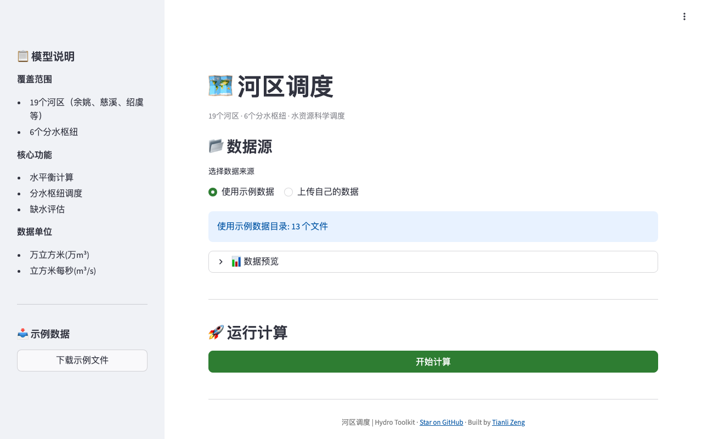

# 🌊 Hydro Toolkit

**English** | [中文](README_CN.md)

Water resource calculation toolkit — reservoir scheduling, pollution capacity, irrigation demand, water efficiency assessment, and more.

[](https://hydro.tianlizeng.cloud)
[](LICENSE)
[](https://python.org)
[](https://streamlit.io)

---

### Try it now — no install needed

| All-in-one | Or try each tool standalone |
|:---:|:---:|
| **https://hydro.tianlizeng.cloud** | See links in the table below |

Upload your data, pick a tool, download the result. Zero setup. All tools include sample data for instant demo.

---

## What can Hydro Toolkit do?

| Tool | What it does | Input | Output | Try it |
|------|-------------|-------|--------|--------|
| **Pollution Capacity** | River/reservoir pollution capacity with tributary segmentation | Excel (flow + zone params) | Excel (monthly capacity) | [Demo](https://hydro-capacity.tianlizeng.cloud) |
| **Reservoir Scheduling** | Multi-reservoir cascaded hydropower dispatch optimization | Excel (inflow + reservoir params) | Excel (daily schedule) | [Demo](https://hydro-reservoir.tianlizeng.cloud) |
| **Water Efficiency** | AHP + CRITIC + TOPSIS assessment for industrial parks | Excel (3-cycle indicators) | Excel (scores + ranking) | [Demo](https://hydro-efficiency.tianlizeng.cloud) |
| **Water Annual Report** | Query Zhejiang province water resource annual data (2019-2024) | Built-in CSV dataset | Excel/CSV export | [Demo](https://hydro-annual.tianlizeng.cloud) |
| **Irrigation Demand** | Paddy + dryland irrigation water balance simulation | TXT (rainfall + evaporation) | Excel (daily demand) | [Demo](https://hydro-irrigation.tianlizeng.cloud) |
| **District Scheduling** | Regional water allocation for 19 districts with sluice cascade | TXT (inflow + demand) | TXT/ZIP (balance results) | [Demo](https://hydro-district.tianlizeng.cloud) |

## Screenshots

### Homepage


### Tools
| | |
|---|---|
|  |  |
|  |  |
|  |  |

## Plugin Architecture

```
hydro-toolkit (Host)          Plugins (git clone)
┌─────────────────┐     ┌──────────────────────┐
│  app.py         │     │  hydro-capacity/     │
│  core/          │────▶│  hydro-reservoir/    │
│  plugins/       │     │  hydro-efficiency/   │
│    hydro-xxx/   │     │  hydro-annual/       │
│    hydro-yyy/   │     │  hydro-irrigation/   │
└─────────────────┘     │  hydro-district/     │
                        └──────────────────────┘
```

The Toolkit is a **host shell** with zero business logic. Each tool is an independent plugin discovered at runtime via `plugin.yaml`. You can use them in the Toolkit or run each one standalone.

| Plugin | Description | Repo | Standalone Demo |
|--------|-------------|------|-----------------|
| 🌊 Pollution Capacity | River/reservoir pollution capacity calculator | [hydro-capacity](https://github.com/zengtianli/hydro-capacity) | [hydro-capacity.tianlizeng.cloud](https://hydro-capacity.tianlizeng.cloud) |
| ⚡ Reservoir Scheduling | Cascade hydropower scheduling optimizer | [hydro-reservoir](https://github.com/zengtianli/hydro-reservoir) | [hydro-reservoir.tianlizeng.cloud](https://hydro-reservoir.tianlizeng.cloud) |
| 💧 Water Efficiency | AHP+CRITIC+TOPSIS assessment | [hydro-efficiency](https://github.com/zengtianli/hydro-efficiency) | [hydro-efficiency.tianlizeng.cloud](https://hydro-efficiency.tianlizeng.cloud) |
| 📊 Water Annual Report | Zhejiang Province data query (2019–2024) | [hydro-annual](https://github.com/zengtianli/hydro-annual) | [hydro-annual.tianlizeng.cloud](https://hydro-annual.tianlizeng.cloud) |
| 🌾 Irrigation Demand | Paddy + dryland water balance model | [hydro-irrigation](https://github.com/zengtianli/hydro-irrigation) | [hydro-irrigation.tianlizeng.cloud](https://hydro-irrigation.tianlizeng.cloud) |
| 🗺️ District Scheduling | 19-district daily supply-demand balance | [hydro-district](https://github.com/zengtianli/hydro-district) | [hydro-district.tianlizeng.cloud](https://hydro-district.tianlizeng.cloud) |

## Quick Start

```bash
git clone https://github.com/zengtianli/hydro-toolkit.git
cd hydro-toolkit
pip install -r requirements.txt
streamlit run app.py
```

Then go to **Plugin Manager** in the sidebar and paste any plugin repo URL to install it.

## Install a Plugin

1. Open the Toolkit in your browser
2. Click **Plugin Manager** (⚙️) in the sidebar
3. Paste a GitHub URL (e.g. `https://github.com/zengtianli/hydro-capacity`)
4. Click **Install** — the plugin appears in the sidebar immediately

## Tech stack

- **Python 3.9+** — calculation engine
- **Streamlit 1.36+** — web interface (plugin-based navigation)
- **pandas / numpy / scipy** — data processing & numerical computation
- **plotly** — interactive charts
- **openpyxl** — Excel I/O

## Key algorithms

| Tool | Method |
|------|--------|
| Pollution Capacity | One-dimensional steady-state model with tributary mixing: `W = 31.536 × b × (Cs - C0×e^(-KL/u)) × (QKL/u) / (1 - e^(-KL/u))` |
| Reservoir Scheduling | Cascaded hydropower dispatch with water-level/storage interpolation (scipy) |
| Water Efficiency | AHP subjective + CRITIC objective weighting, combined via α slider, TOPSIS ranking |
| Irrigation Demand | Penman-Monteith ET₀ based paddy/dryland water balance with daily time step |
| District Scheduling | Daily water balance across 19 districts with dynamic equilibrium zones and sluice cascade |

## Develop Your Own Plugin

See [ARCHITECTURE.md](ARCHITECTURE.md) for the full plugin specification, namespace package rules, and step-by-step guide.

## Contributing

Issues and PRs are welcome. Please open an issue first to discuss changes.

## License

[MIT](LICENSE)
